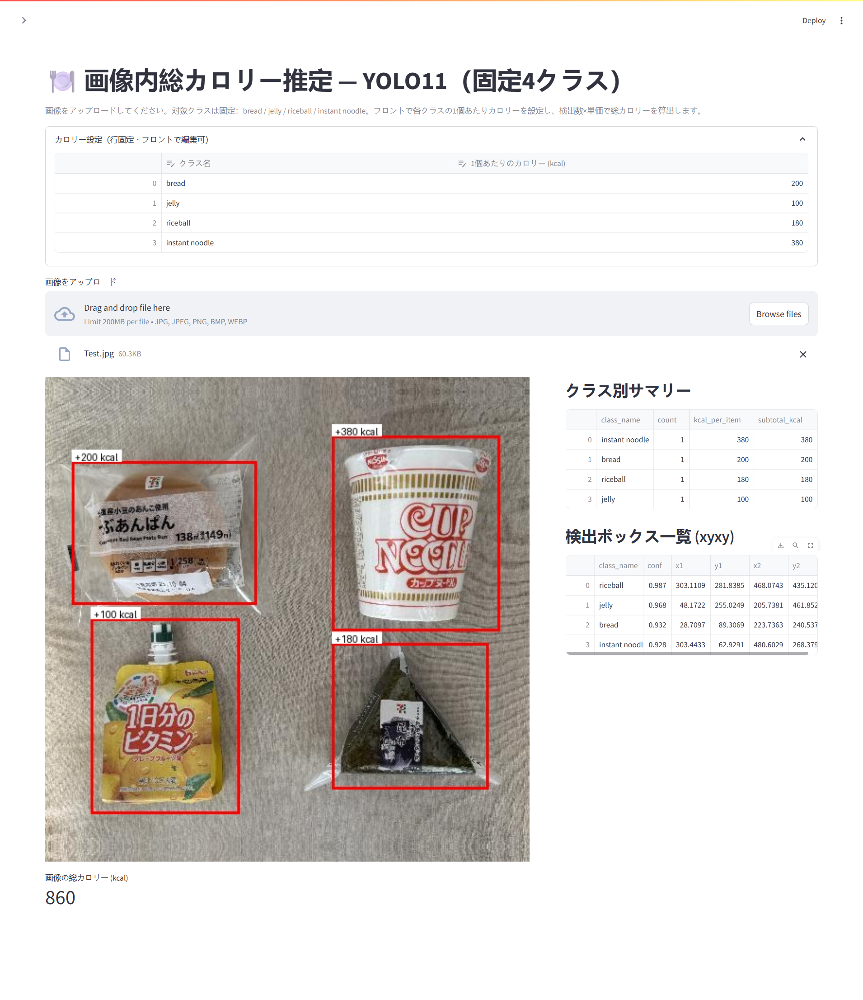
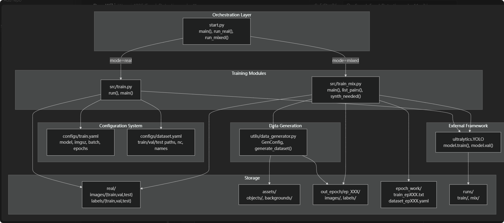
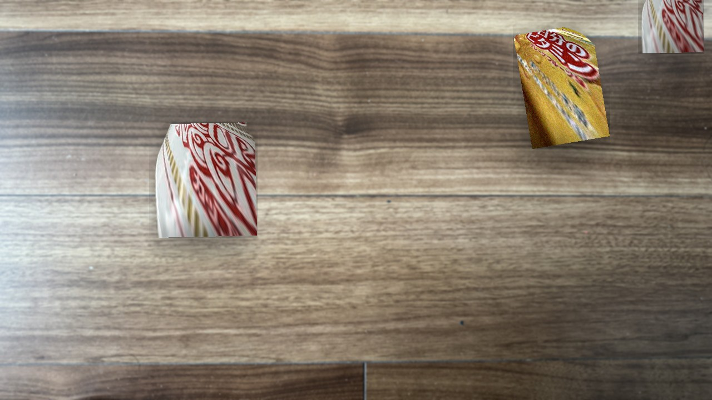
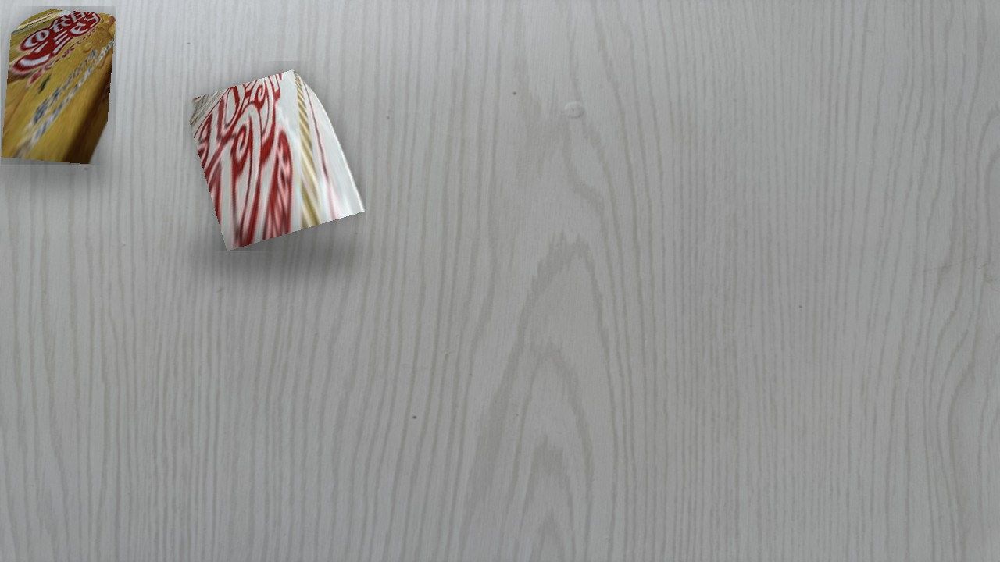
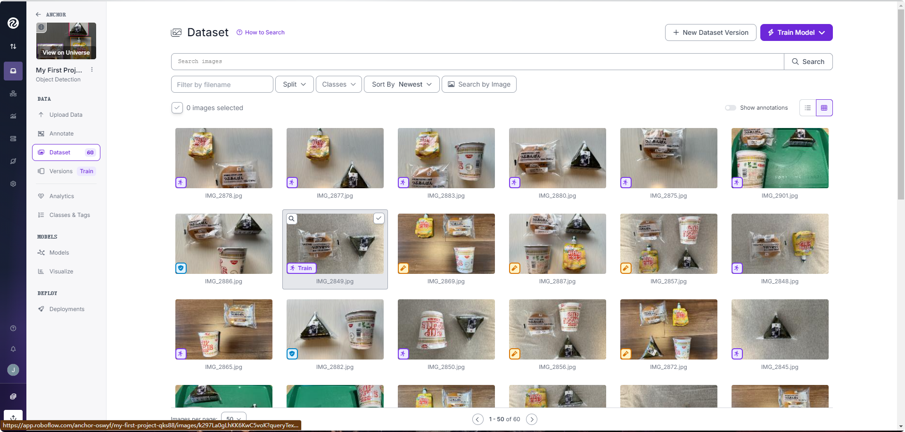
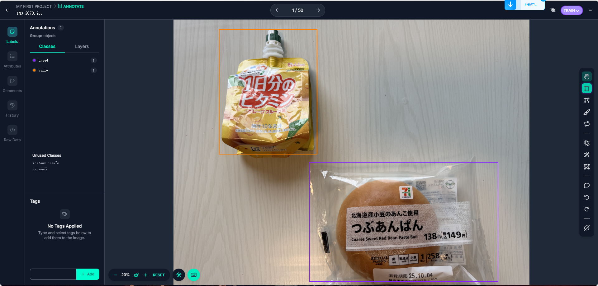
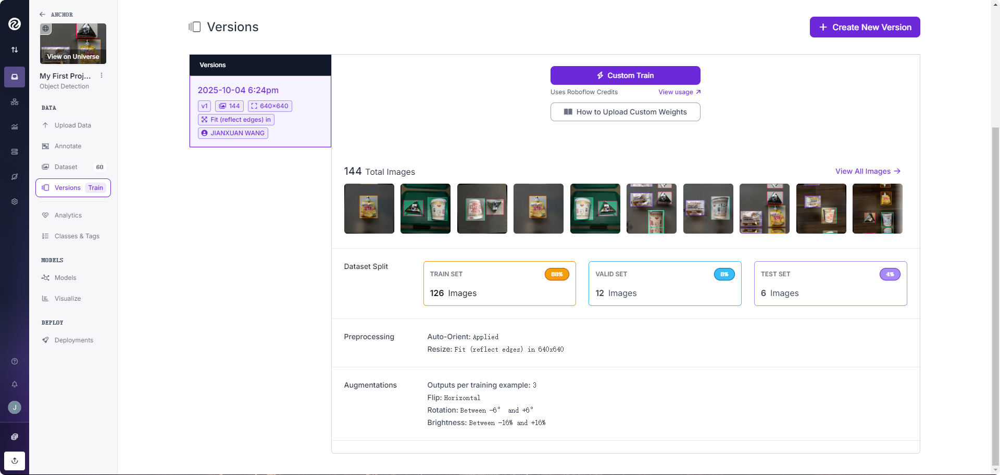
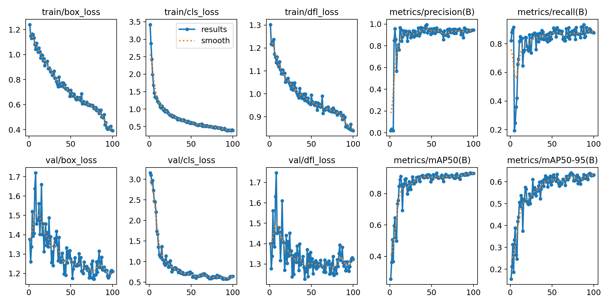

# YOLOv11で構築したコンビニ食品の検出モデル
# はじめに
## 1. 概要
本書では **Ultralytics YOLOv11** をベースにしたコンビニ食品の物体検出プロジェクトの特徴、構築、使用方法などについて紹介する。データ準備について、60枚のコンビニ食品の写真を収集し、４つのラベル（「bread」、「instant noodle」、「riceball」、「jelly」）でデータのアノテーションを行い、検出モデルを学習した。
結果として、appにアップロードした画像の中に指定した4種類の食品を正確に検出してから、入力した各種食品のカロリーで、画像内食品の総カロリーの算出ができた。


 <div align="medium">
    
</div>

このプロジェクトは、[YOLOv11](https://github.com/ultralytics/ultralytics) を参考にして作成されていた。
## 2. 本プロジェクトの全体像と機能
本プロジェクトの全体像として、start.py を中核オーケストレーターとするハブ＆スポーク型アーキテクチャを採用しており、環境構築・依存関係管理・モード選択を担う。このエントリポイントから、実行は 2 種類の独立した学習パイプラインのいずれかへ分岐する。
 <div align="medium">
    
</div>
本プロジェクトの特徴は以下となる。

- ラッパースクリプトで共通プロセスの実行や実行パラメータ設定を一元化に対応
- 画像モザイク合成スクリプトによるデータ拡張に対応
- 合成したデータ+リアルデータによる混合学習に対応
- 合成したデータの出力
- 画像入力の推論に対応
- 学習済みモデルのエクスポートに対応

> **補足**: 実際に学習するクラス（カテゴリ）はデータセット定義（`data/*.yaml`）に依存する。本書では、食品検出を想定した一般的な手順を示す。
## 3. 本プロジェクトの重要機能-モザイクデータ拡張 × 混合学習
本プロジェクトには、検出対象となるオブジェクト単体画像と任意の背景画像をランダムにモザイク合成スクリプトを利用してデータ拡張を行い、実際のデータと合成したデータを一定の比例で混合して学習用データセットを生成して学習を行った。
### ①目的
- データセット内に各クラスのデータ分布の偏りに対する補強、データ多様性の拡張
- 密集・遮蔽に対する頑健性の向上（スケール・位置のランダム化）
- 評価の公正性を担保（評価用/テスト用データは実写のみ）
### ②モザイクデータ拡張のコア機能
- 素材からYOLO形式のデータセットを自動生成
- クラス出現頻度の制御
- クラスオブジェクトに対する画像処理
- 配置と衝突/切り落としの制御
- データ分割と正確な枚数指定
- yamlファイルの自動書き出し
- seed設定による再現性とエポックごと生成データの更新
### ③混合学習のポリシー
- 学習用データ:「実写+合成」を一定比率でミックスをする。
- 評価用/テスト用データ:実写のみにする。
- 1エポックを複数のフェーズに分割し、各種のデータ利用ポリシーを適用する。
### ④合成データの例
 <div align="medium">
    
</div>
 <div align="medium">
    
</div>

## 4. YOLO v11について
YOLOv11は、Ultralyticsが提供する最新世代のリアルタイム物体検出モデルで、画像を一度の畳み込みで走査して物体の位置とクラスを同時に推定するone-stage手法である。軽量なnから高精度なxまで複数のモデルサイズが用意され、用途に応じて速度と精度のバランスを選べる。画像・動画・Webカメラ入力に対応し、既存重みを用いた転移学習が容易、CLIとPython APIの両方で学習・推論・評価を再現しやすいのが実務上の強み。さらにONNX/TensorRT/OpenVINOなどへのエクスポートやモザイク等のデータ拡張、mAPによる評価が整っており、製造検査・小売・ロボティクスなどリアルタイム性が求められる現場に適している。
## 5. リポジトリ構成（抜粋）
```
Food_Detection-yolov11/
├─ configs/            # 学習や推論の設定（任意）
├─ data/               # データセット設定（YAML）やサンプル
├─ runs/               # 学習・推論の出力（Ultralytics 標準）
├─ src/                # プロジェクトのソースコード
├─ ultralytics/        # Ultralytics ライブラリ
├─ utils/              # 補助スクリプト・ユーティリティ
├─ yolo11n.pt          # 事前学習済み重み
├─ start.py            # エントリポイント（プロジェクト用ラッパースクリプト）
├─ requirements.txt    # ライブラリ依存関係
└─ README.md
```
## 6. 動作環境
- Python 3.8 以上を推奨する
- （任意）CUDA 対応 GPU + 最新の NVIDIA ドライバ
- 依存関係は `requirements.txt` を参照する
- 実行環境はGoogle Colabを推奨する（本プロジェクトの動作確認はGoogle Colabで実施した）

> **補足**: Google Colabは、GPUへの無料アクセスを提供するクラウドベースのプラットフォームであり、本書は、Google ColabのGPUを使って、ディープラーニングモデルの学習を行なっていたことを前提として作成した。

---

# データ準備

## 1. 食品画像データの収集

自分で200枚以上の領収書コンビニ食品の写真を収集し、写真の質量や写真内食品種類のバラエティを考慮して60枚の写真を選び、生データセットを作成した。
## 2. アノテーションツールの選定
本プロジェクトでは、Roboflowを利用して画像のアノテーションを行った。

> **補足**: [Roboflow](https://app.roboflow.com/)はデータセットのアノテーションを簡単かつ迅速に行い、さまざまなモデルの学習に適した形式に変換できるソリューションを提供している。
## 3. 生データのアップロード
60枚のコンビニ食品写真のデータをRoboflowにアップロードした。


<div align="medium">
    
</div>

## 4. アノテーションの実施
本プロジェクトでは、食品写真から以下の4つのラベルを作成した。写真内にある各オブジェクトに対してボックスで正確に囲み、ラベルを付与した。
- 「bread」
- 「instant noodle」
- 「riceball」
- 「jelly」

<div align="medium">
    
</div>

## 5. 前処理
アノテーション後、学習用データセット生成の前処理を行った。
- データセットの分割（学習用/推論用/テスト用）
- 画像のリサイズ（640x640）
- 画像辺縁に対する処理
- 軽くの水増し
前処理を行った結果、データセットの126枚が学習用、12枚を推論用、6枚はテスト用として準備された。
<div align="medium">
    
</div>

## 6. データセットの取得
Roboflowの「Download Dataset」機能を利用して、YOLOv11に適した画像内オブジェクトボックスの位置の正規化座標が記載しているテキストファイルの入手は可能。このボックス位置情報を利用して学習を行った。

---

# Colabのセットアップ

## 1. Colabの起動と設定変更
[Google Colab](https://colab.research.google.com/)の公式サイトからColabを起動して、「ランタイムのタイプを変更」オプションからハードウェアアクセラレータをT4 GPUに変更した。
## 2. Google Driveへの接続
Google Driveを活用して学習データの格納などのため、以下のコードでGoogle Driveへの接続を行った。
```python
from google.colab import drive
drive.mount('/content/drive')
```
## 3. リポジトリのクローン
Colab環境に本プロジェクトをクローンし、プロジェクト直下のディリクトリに移動した。
```
!git clone https://github.com/Wangjx1995/Food_Detection-yolov11.git
%cd Food_Detection-yolov11
```
---
# 学習

## 1. start.pyで学習の開始
本プロジェクトには、共通処理をまとめた **ラッパースクリプト** `start.py` が含まれている。`start.py`は以下の役割を担う。
- 環境ブートストラップ：Colab 上で環境を構成し、Google Driveをマウント、リポジトリをgit clone、Pythonの依存関係を厳密なバージョン固定で管理する。
- モード分岐：ユーザー設定に基づき、実行を real-only（実写データのみ） または mixed（実写＋合成） の学習パイプラインにディスパッチ。
- 依存関係の分離：NumPy / SciPy / Matplotlib / Ultralyticsを強制アンインストール＋制御再インストールで入れ替え、依存衝突を解消する。
下記の起動コマンド例で学習を開始する。
```
python3 start.py --mode mixed --skip_drive \
--repo_url https://github.com/Wangjx1995/Food_Detection-yolov11.git \
--repo_dir /content/Food_Detection-yolov11 \
--real_root /path/to/real \
--assets_dir /path/to/assets \
--out_base /path/to/out_epoch \
--weights /path/to/yolo11n.pt \
--device 0
```
---

# 学習の結果
モデルを100エポックで学習した結果、全クラスにおいて平均適合率（mean average precision）が0.93という良好な精度を達成しました。
 <div align="medium">
    
</div>


